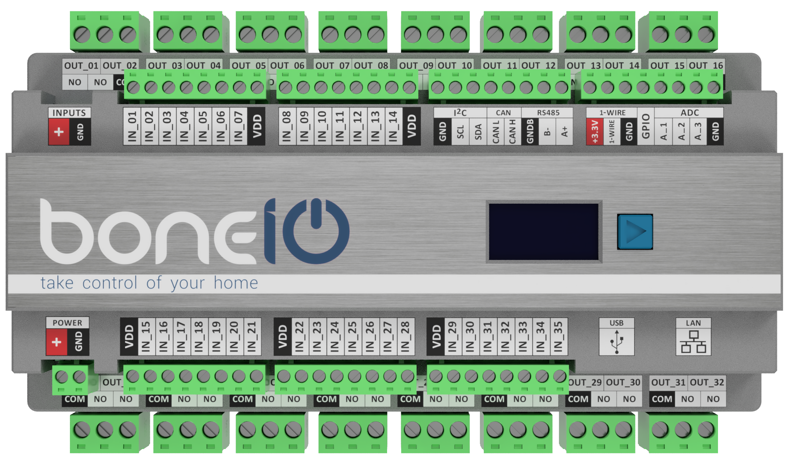

# Input Board ESP

Photo above presents full device, which is set of Input board and relay board.

This repository contains input board for boneIO ESP Home Automation software.

It is powered by 24V DC.
It contains:
- 35 input driven by MCP23017 / PCF8575
  - inputs can be driven by external power supply
- external I2C bus
- OLED screen
- onboard button
- CAN bus
- RS485
- GPIO PIN 1-Wire interface 
- 2 ADC interfaces
- USB for firmware upgrades and logging purposes
- LAN interface

Device uses WT32-Eth01 with WiFi and LAN interfaces on board!
It is prepared for Esphome software, which will have separate repo.